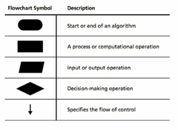
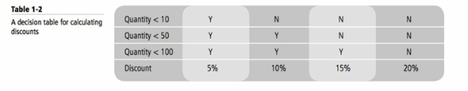

# Introduction to Programming
## Lesson 1

### Lesson Skill Matrix

### Skill/Concepts 

- Understanding Computer Programming
- Understanding Decision Structures
- Understanding Repetition Structures
- Understanding Exception Handling

### MTA EXAM OBJECTIVE

- Understanding Computer storage and data types
- Understand Computer decision structures.
- Identify the appropriate method for handling repetition
- Understand error handling

    Imagine that you are a software developer for the Northwind Corporation. As part of your job, you develop computer programs to solve business problems. Examples of the work you do include analyzing customer orders to determine applicable discounts, updating stock information for thousands of items in a company’s inventory, and writing interactive reports that allow users to sort and filter data.
    It is important for you to make sure your programs are designed exactly according to specifications. You also need to ensure that all computations are accurate and complete. The programs that you write need to be robust, and they should be able to display error messages but continue processing.

    The programming language that you use provides you with various tools and techniques to get your tasks done. Based on the task at hand, you select the data types and the control structures that are best suited for solving the problem.

# Understanding Computer Programming

## The Bottom Line

    A computer program is a set of precise instructions to complete a task. In this section, you’ll learn how to write algorithms and computer programs to solve a given problem. In addition to writing your first computer program using the C# programming language, you’ll also learn about the basic structure of computer programs and how to compile, execute, provide input to, and generate output from a program.

## Introducing Algorithms

An Algorithm is a set of ordered and finite steps to solve a given problem.

Algorithm refers to a method of solving problems.

Algorithms can be described in English, but such desciptions are often misintrepreted because of the inherent complexity and ambiguity in a natural language.

Algorithms are frequently written in simple and more precise formats, such as flowcharts, decision trees, and decision tables.

Represent algorithms as a diagram, table, or graph.

The techniques are often employed prior to writing programs in order to gain a better understanding of the solution.

These algorithm-development tools might help you in epressing a solution in an easy-to-use way, but they cant be directly understood by a computer.

In order for a computer to understand a algorithm, you'l need to write a computer program in a more formal way by using a programming language like C#.

Two techniques for presenting algorithms, flowcharts and decision tables .

More precise than a natural language but less formal and easier to use than a computer language.

# Introducing Flowcharts

A Flowchart is a graphical representation of an algorithm. A flowchart is drawn using symbols.

Flowchart lists in the correct order all nessessary steps to preform the operation.

The flow of control starts with the start symbol and ends at the stop symbol.

The process and input/output operation symbols always have a single entry and a single exit.

In contract, the decision symbol has a single entry but multiple exits.

You can test a flowchart by performing a dry run.

In a dry run you manually trace through steps of the flowchart with the test data to check whether the correct paths are being followed.

# INTRODUCING DECISION TABLES

When an algorithm involves a large number of conditions, decision tables are a more compact and readable format for present the algorithm.

Decision table for calculating a discount.

This table generates a discount percentage depending on the quantity of product purchased.

The bold lines in the decision table divide the table in four quadrants.

The first quadrant (top left) specifices the condition. 

The second quadrant (top right) specifics the rules.

The rules are the possible combination of the outcome of each condition.

The third quadrant (Bottom left) specifices the action.

The last quadrant (Bottom right) specifies the action items corresponding to each rule.

To find which action item to apply, evaluate each confition to fin the matching rule.

Choose the action specified in the column with the matching rule.

# Introducting C#.

C# is a popular high-level programming language that allows you to write computer programs in a human-readable format.

C# is a part of the .NET Framework and benefits from the runtime support and class libraries provided by the .Framework.

Computers need precise and complete instructions to accomplish a task.

These sets of instructions are called computer programs, or just programs for short.

At the most basic level, computers use the binary number system to represent info and code.

In this system, each value is represented using only two symbols, 0 and 1. A computer program written using the binary number system is called binary code.

Using binary code to program a computer is terse and difficult to accomplish for any non trival task. This to simplify programming, scientists and computer engineers have abstractions include software (such as operating systmes, compilers, and various runtime systmes) that take responsibility for transalting a human readable program into a machine-readable program.

Most modern programs are written in a high-level language such as C#, Visual Basic or Java.

These languages allow you to write precise instructions in a human-readable form.

A language compiler then translates the high-level language into a lower-level language that can be understood by the runtime execution system.

Each progamming language provides its own set of vocab and grammar ( Also known as syntax ). In this course, you'll learn how to program by using the C# programming language on the .Net Framwork.

The .Net Framework provides a runtime execution environment for the C# program. 

The Framework also contains class libs that provide a lot of resuable core functionality that you can use directly in your C# program.

In this course, you will be using an integrated development environment (IDE) to develop your code.

You can use either Visual studio.

Highly productive environment for developing and testing your programs.

# Write a C# Program

